1. First, log in to your Discord account on the web, then click the 【Add a Server】 button in the left sidebar.

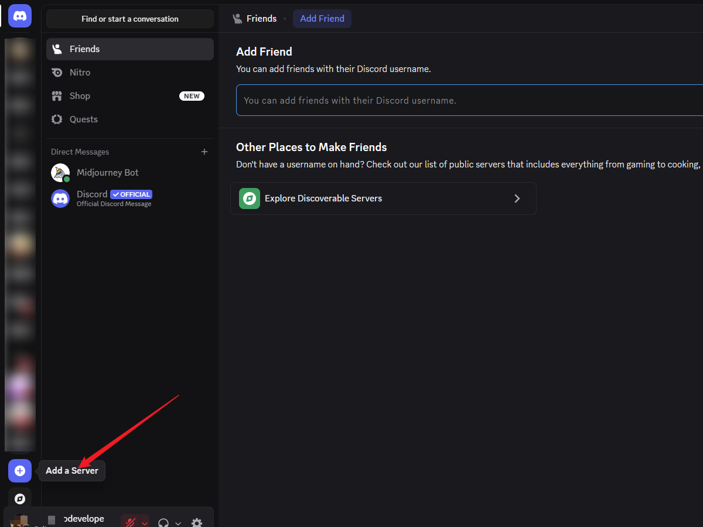


2. Click to join a server.

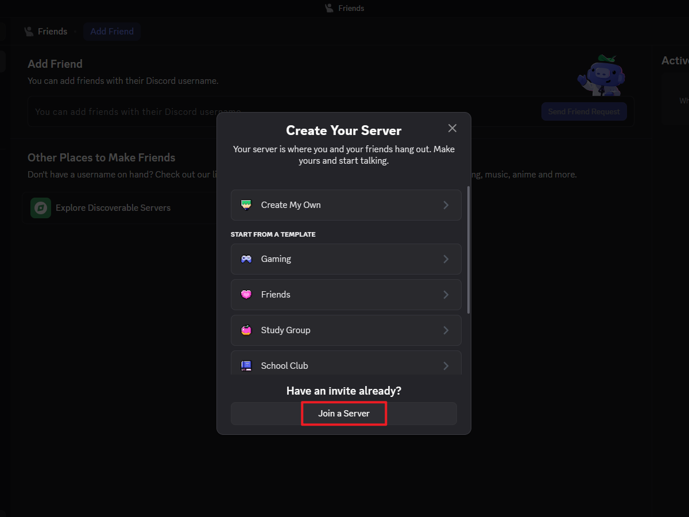


3. Enter the Midjourney invite link: http://discord.gg/midjourney to join the server.

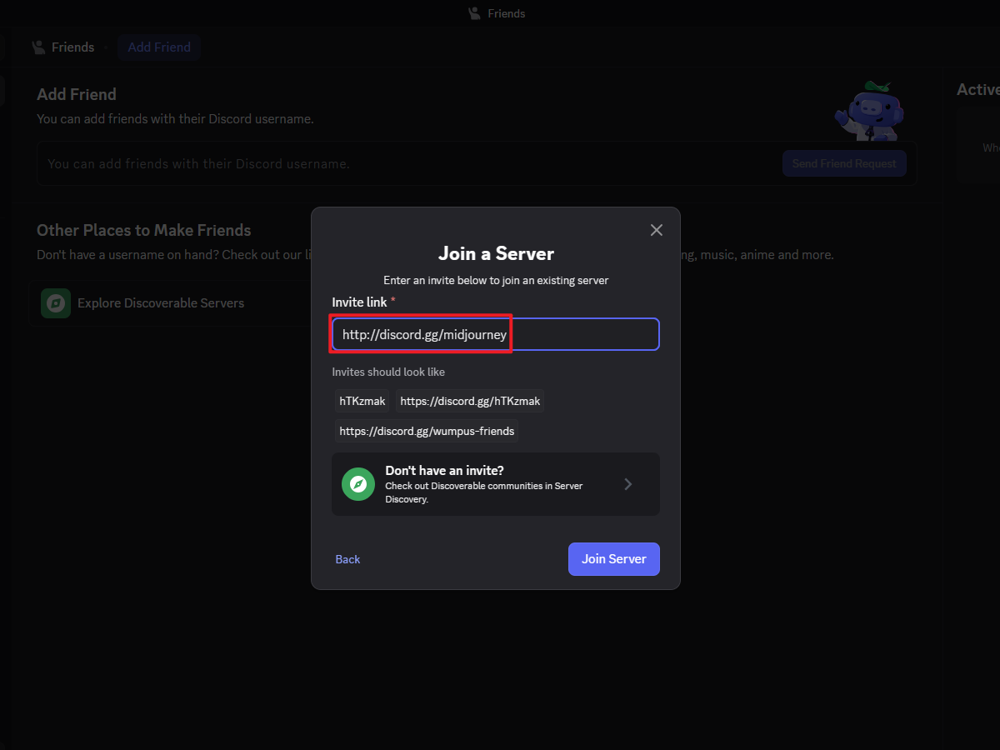


4. Click the Add a Server button again, this time select "Create My Own".

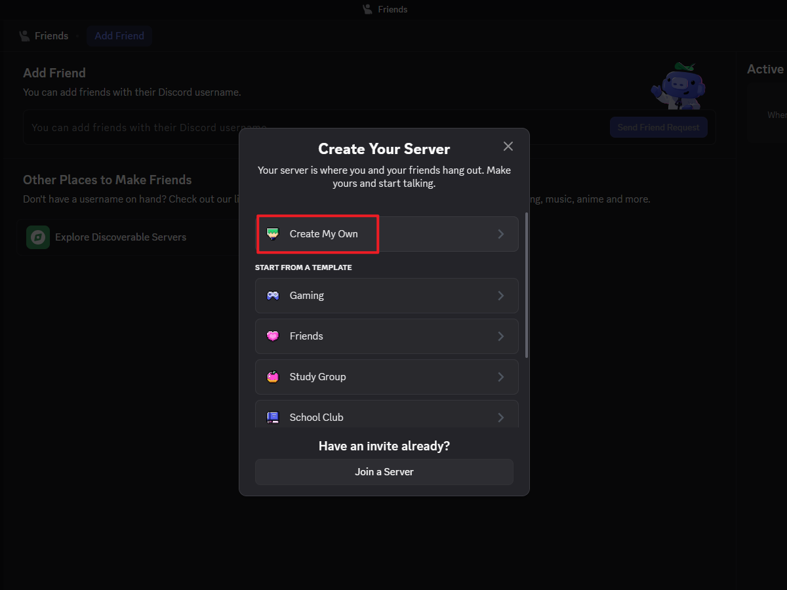


5. Enter a name for the server you want to create.

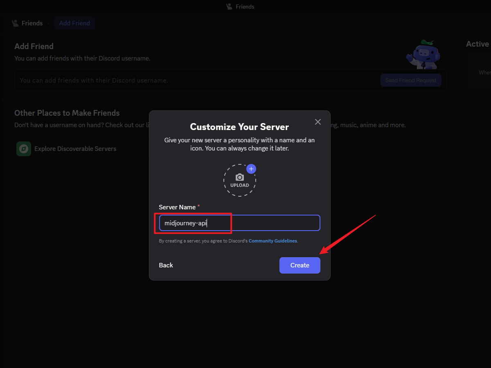


6. After creation, you can get the server ID and channel ID from the browser address bar, as shown below.

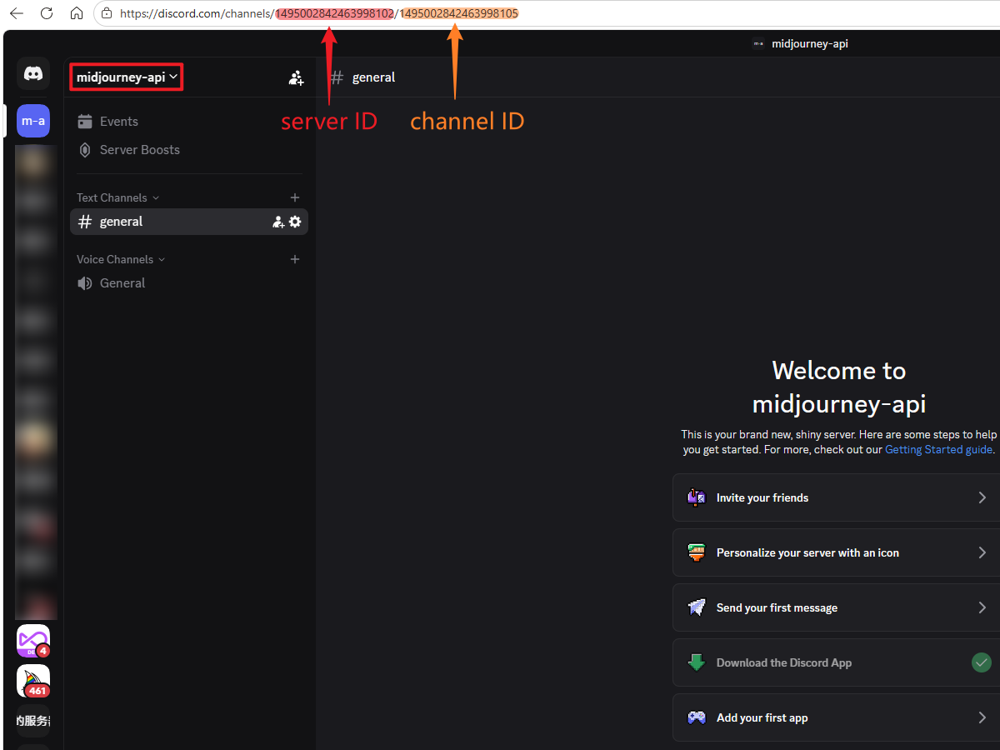


7. Go to the official Midjourney server, and click on `Midjourney Bot` in the member list.

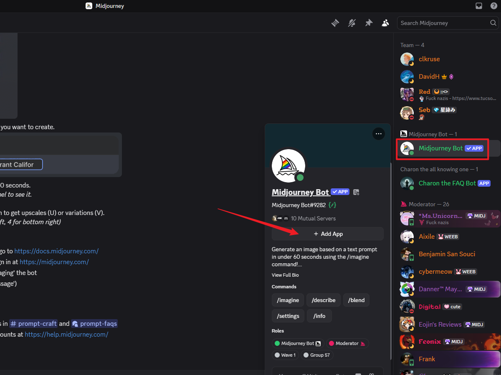


8. Click the Add App button and select "Add to Server".

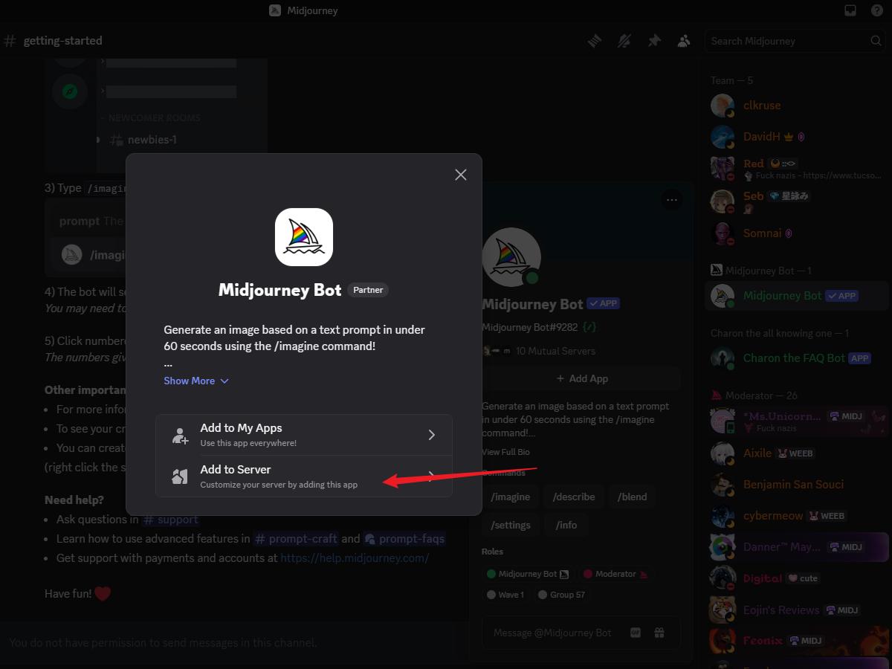


9. Select the server you just created to add the Bot to it.

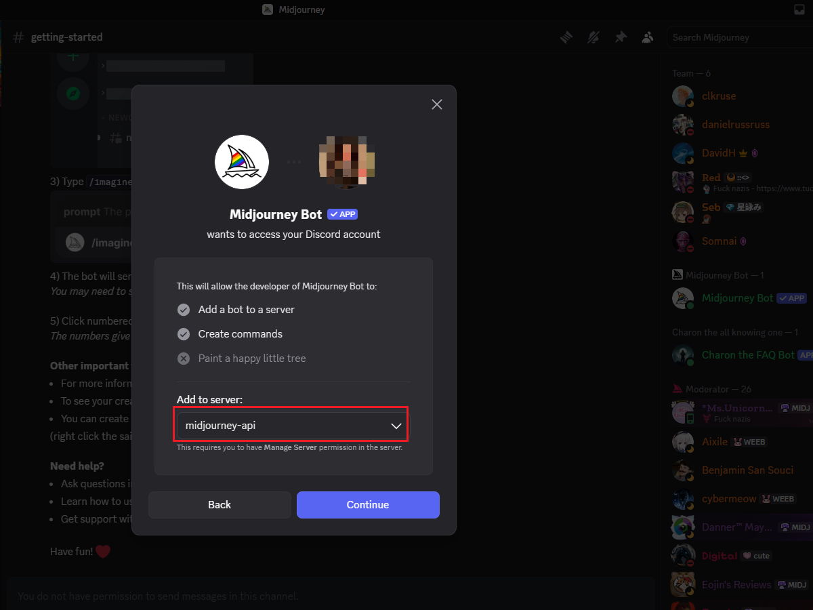


10. Go to the midjourney-api server you created and test whether images can be generated normally.

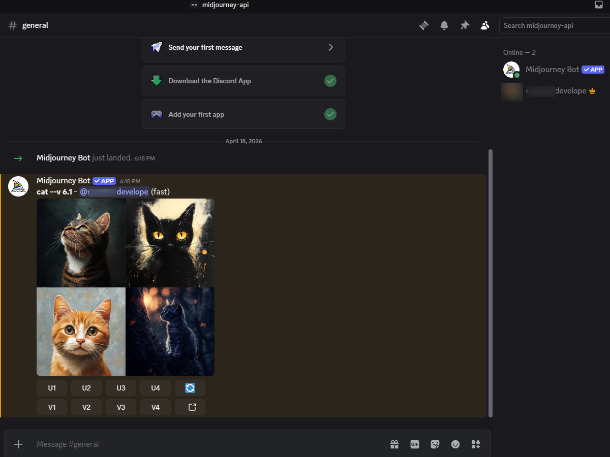


11. Press F12 to open the browser developer tools and obtain the User Token.

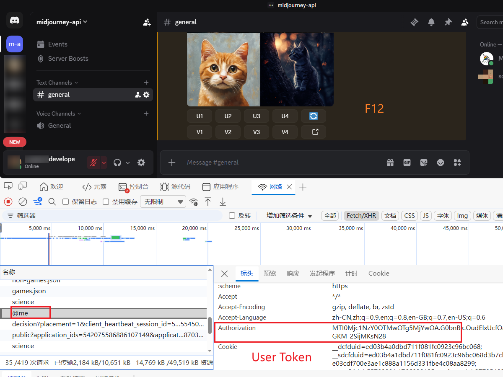


At this point, the server ID, channel ID, and User Token required to run the program have all been obtained.

```
user_token: "User Token"
guild_id: "server ID"
channel_id: "channel ID"
```

Use these values when creating an account with `POST /api/v1/accounts`.
