1.首先在网页登录Discord账号，然后在左侧菜单栏点击按钮【添加服务器】

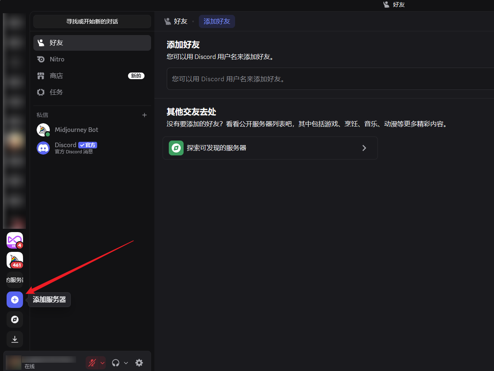


2.点击加入服务器

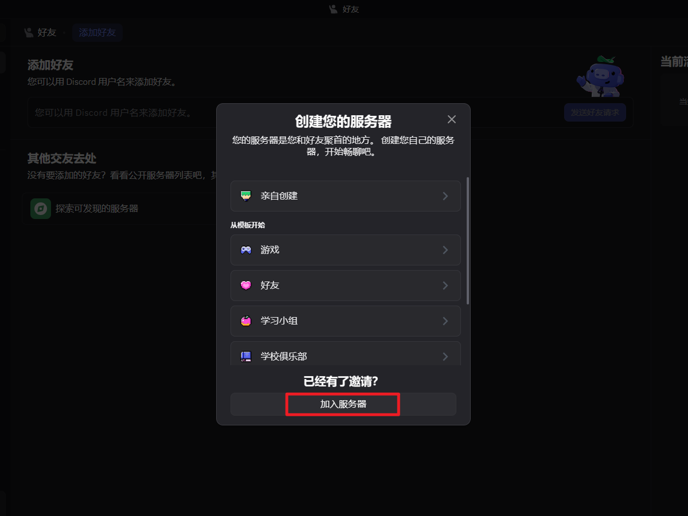


3.填入midjourney的邀请链接：http://discord.gg/midjourney ，加入服务器。

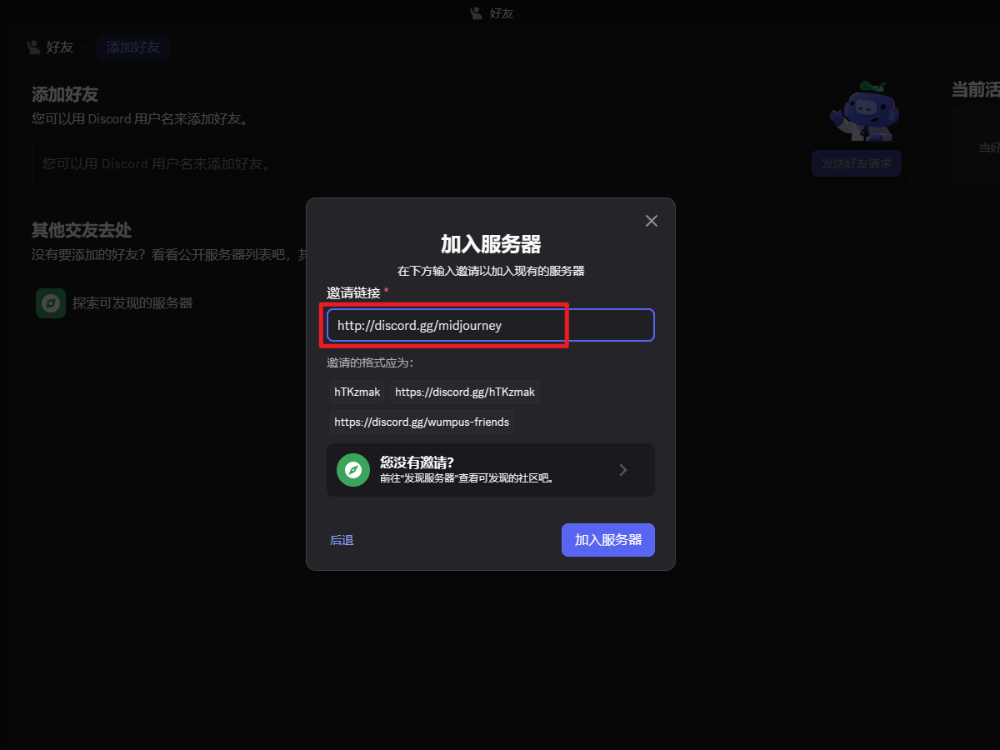


4.然后再次点击加入服务器+按钮，这次选择 ”亲自创建“

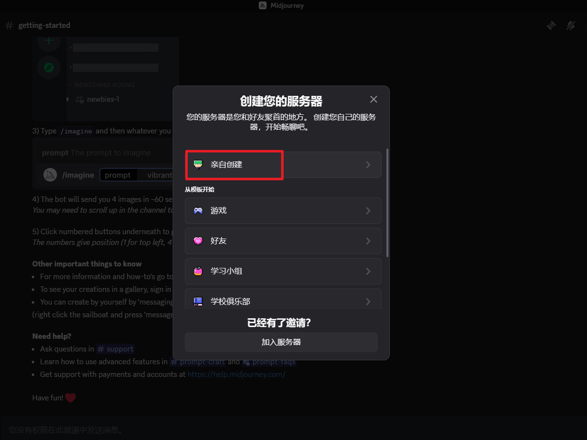


5.输入要创建的服务器名称

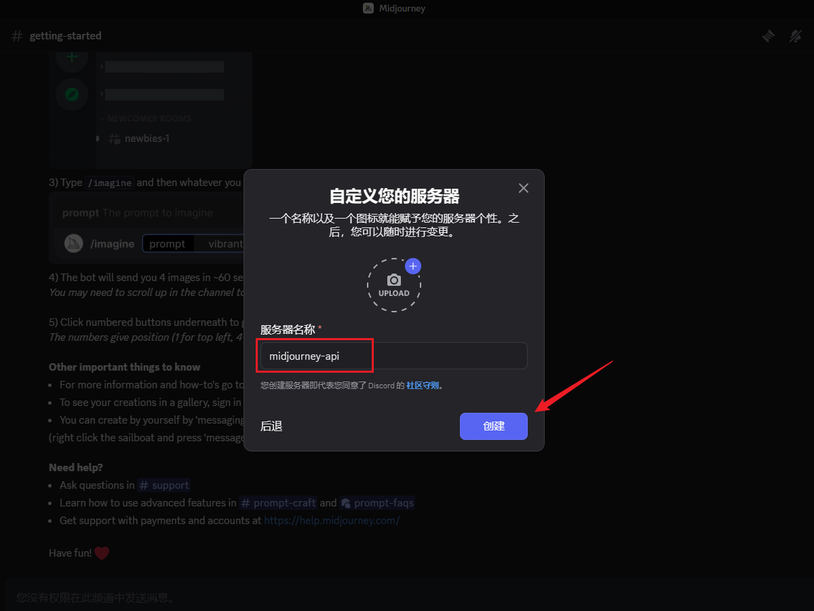


6.创建成功后，我们就能从浏览器的地址栏获得server ID 和 channel ID， 获取方式如下

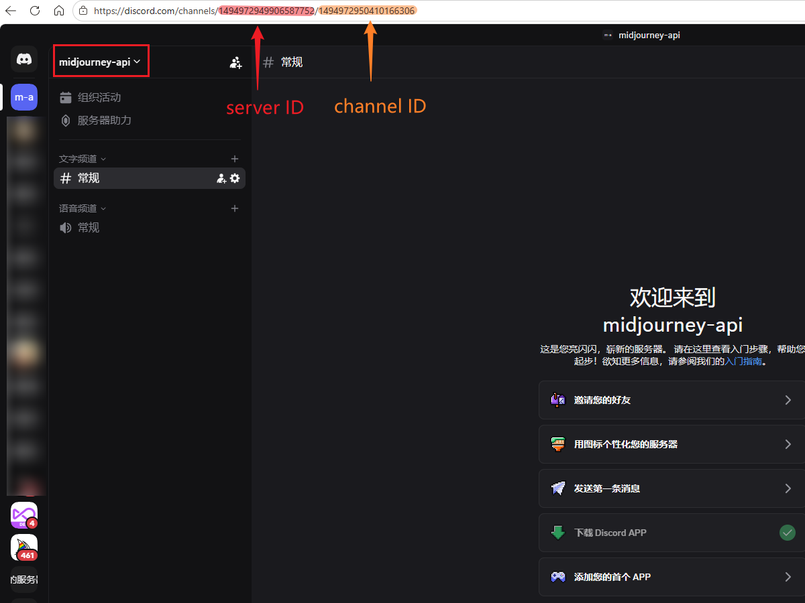


7.然后我们进入Midjourney官方服务器内，在成员列表鼠标点击 `Midjourney Bot` 

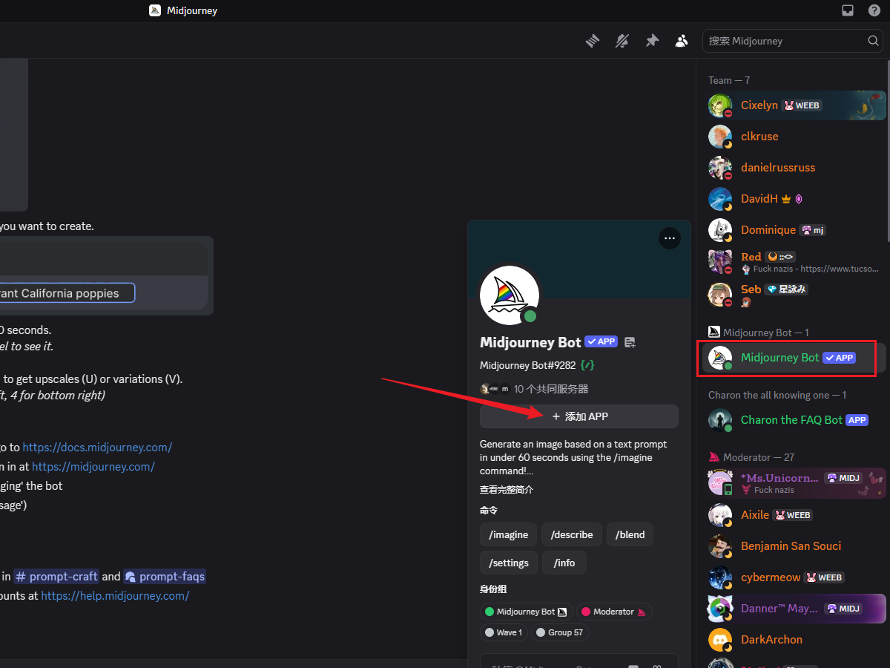


8.点击添加APP按钮-添加至服务器

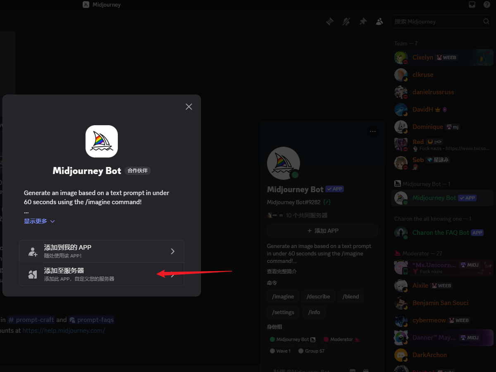


9.选择我们刚创建的服务器`midjourney-api`，将Bot添加到我们创建的服务器中

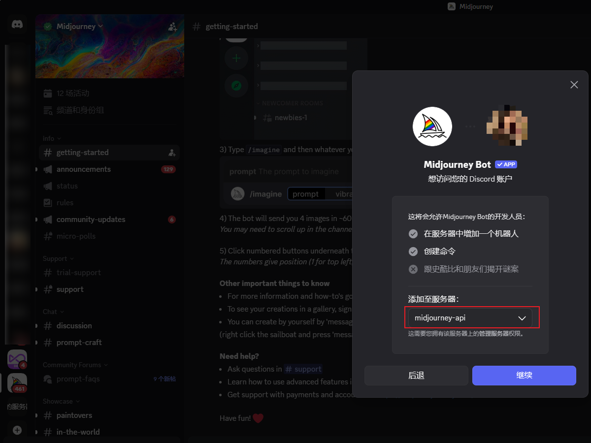


10.进入我们创建的 midjourney-api 服务器，测试一下是否能正常生成图片

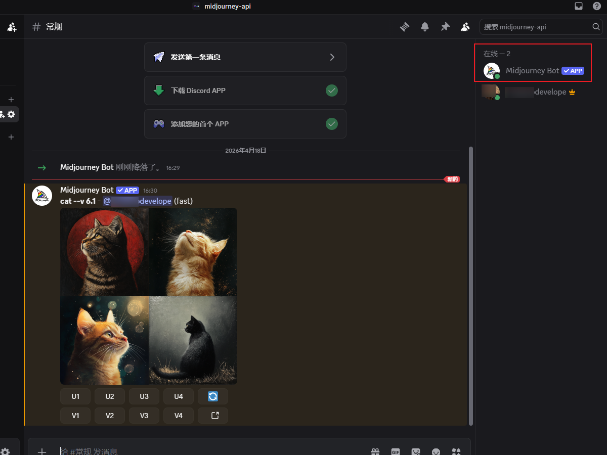


11.按F12打开浏览器开发者工具，获取User Token

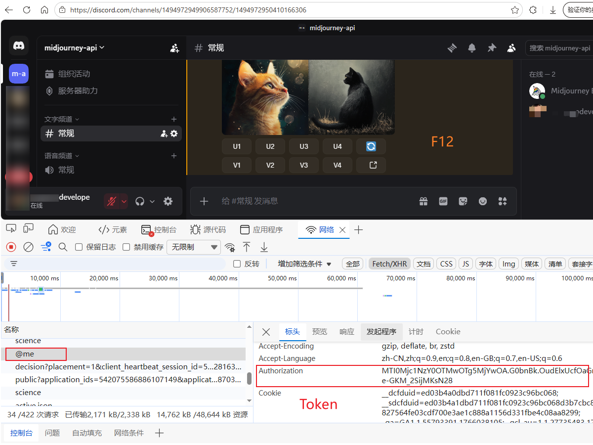


至此，程序运行所需要的server ID、channel ID、User Token都已经获取得到。

```
user_token: "User Token"
guild_id: "server ID"
channel_id: "channel ID"
```

