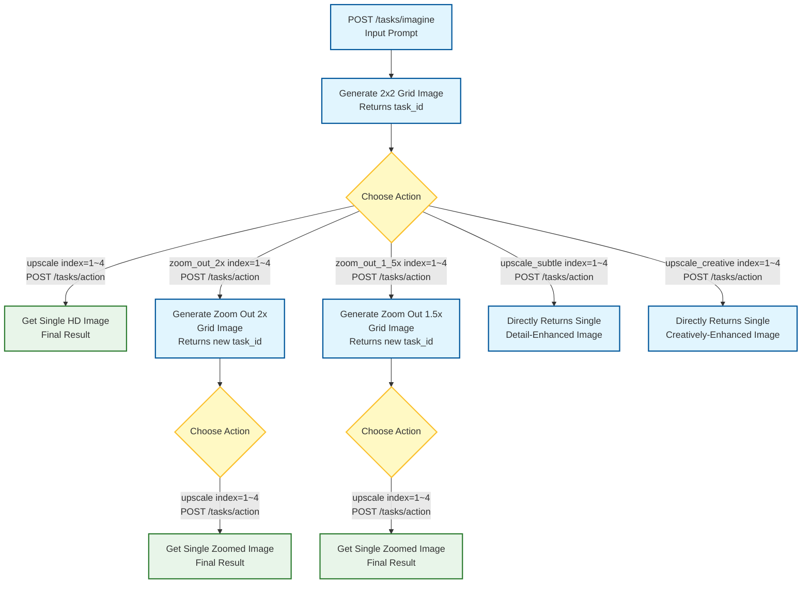

# Midjourney API

[English](./README.md) | [简体中文](README_ZH.md)

An unofficial Midjourney API service that interacts with Midjourney via Discord Bot, providing standard RESTful interfaces with support for multi-account concurrency, task queuing, and automatic image upload to object storage.

## Features

- **Image Generation**: Call Midjourney `/imagine` command with a prompt to generate images
- **Task Actions**: Support post-processing actions such as Upscale and Zoom Out
- **Multi-Account Management**: Configure multiple Discord accounts for concurrent processing and load balancing
- **Task Queue**: Redis-based async task queue with multi-worker concurrent consumption
- **Task Callback**: Support task status change callback, including progress updates
- **Object Storage**: Automatically upload generated images to Aliyun OSS or AWS S3
- **Swagger Docs**: Built-in API documentation, accessible at `/swagger/index.html`

## Tech Stack

| Category | Technology |
|----------|------------|
| Language | Go 1.23+ |
| Web Framework | Gin |
| Database | PostgreSQL + GORM |
| Cache / Queue | Redis |
| Discord | discordgo (WebSocket) |
| Object Storage | Aliyun OSS / AWS S3 |
| Logging | Zap |
| Configuration | Viper |
| Containerization | Docker / Docker Compose |

## Project Structure

```
midjourney-api/
├── cmd/server/         # Entry point
├── config/             # Configuration files
├── internal/
│   ├── app/            # Application initialization and lifecycle
│   ├── config/         # Configuration structs
│   ├── discord/        # Discord WebSocket listener and message parser
│   ├── handler/        # HTTP request handlers
│   ├── middleware/     # Middleware (logging, recovery, etc.)
│   ├── model/          # Data models
│   ├── oss/            # Object storage uploader
│   ├── redis/          # Redis client
│   ├── repository/     # Database access layer
│   ├── router/         # Route registration
│   ├── service/        # Business logic layer
│   └── worker/         # Async task workers
└── pkg/
    ├── constants/      # Constant definitions
    ├── errors/         # Error definitions
    ├── logger/         # Logger initialization
    └── response/       # Unified response format
```

## Quick Start

### Prerequisites

- Go 1.23+
- PostgreSQL 15+
- Redis 7+
- One or more Discord Bots that have joined a Midjourney server

### Option 1: Docker Compose (Recommended)

```bash
# 1. Clone the repository
git clone https://github.com/your-username/midjourney-api.git
cd midjourney-api

# 2. Edit the configuration file
cp config/config.yaml.example config/config.yaml
# Fill in Discord Token, Guild ID, Channel ID, etc.

# 3. Start the service
docker-compose up -d
```

Access the service at `http://localhost:8080`

### Option 2: Run Locally

```bash
# 1. Install dependencies
go mod download && go mod tidy

# 2. Start dependency services (PostgreSQL + Redis)
docker-compose up -d postgres redis

# 3. Edit the configuration file
# Edit config/config.yaml

# 4. Generate Swagger docs
swag init -g cmd/server/main.go -o docs

# 5. Build
go build -o bin/server.exe ./cmd/server

# 6. Run
./bin/server
```

## Configuration

Edit `config/config.yaml`:

```yaml
server:
  port: 8080
  mode: debug  # debug / release

database:
  host: localhost
  port: 5432
  user: mj_admin
  password: 123456
  dbname: midjourney

redis:
  host: localhost
  port: 6379

discord:
  application_id: "936929561302675456"
  imagine_command_id: "938956540159881230"
  imagine_command_version: "1237876415471554623"
  describe_command_id: "1092492867185950852"
  describe_command_version: "1493662068505706617"
  api_base_url: "https://discord.com/api/v9"

task:
  timeout: 300       # Task timeout in seconds
  max_retries: 3     # Maximum retry attempts
  worker_count: 3    # Worker concurrency

oss:
  enable: false      # Enable OSS upload
  provider: aliyun   # s3 / aliyun
```

## Workflow

### Standard Workflow



> **Notes**:
> - `upscale`: Upscales the selected image from the grid into a single HD image; further actions can be performed on the result
> - `zoom_out_2x`: Applies a 2x zoom-out (canvas expansion) on the selected image, generating a new grid; requires another Upscale to get a single image
> - `zoom_out_1_5x`: Applies a 1.5x zoom-out (canvas expansion) on the selected image, generating a new grid; requires another Upscale to get a single image
> - `upscale_subtle` / `upscale_creative`: Directly applies detail or creative enhancement to the selected image and **returns a single image immediately**, no second action required

## API Reference

### Task Management

| Method | Path | Description |
|--------|------|-------------|
| `POST` | `/api/v1/tasks/imagine` | Create an image generation task, supports `callback_url` |
| `POST` | `/api/v1/tasks/describe` | Create an image describe task, supports `callback_url` |
| `POST` | `/api/v1/tasks/action` | Perform a task action (Upscale / Zoom Out, etc.), supports `callback_url` |
| `GET` | `/api/v1/tasks/:task_id` | Get task details |
| `GET` | `/api/v1/tasks` | List all tasks |
| `GET` | `/api/v1/tasks/queue` | Get the waiting queue |

Supported `action_type` values for `/api/v1/tasks/action`:

| action_type | Description |
|-------------|-------------|
| `upscale` | Standard upscale — enlarges the selected grid image into a single HD image |
| `zoom_out_2x` | 2x zoom-out (canvas expansion) — generates a new 2x2 grid image |
| `zoom_out_1_5x` | 1.5x zoom-out (canvas expansion) — generates a new 2x2 grid image |
| `upscale_subtle` | Subtle upscale (detail preservation) — directly returns a single enhanced image |
| `upscale_creative` | Creative upscale (re-render) — directly returns a single enhanced image |

### Account Management

Midjourney Accounts are managed dynamically via API.

| Method | Path | Description |
|--------|------|-------------|
| `POST` | `/api/v1/accounts` | Add an account and start its Discord listener |
| `GET` | `/api/v1/accounts` | List all accounts |
| `DELETE` | `/api/v1/accounts/:id` | Delete an account and stop its listener |

For how to obtain the `user_token`, `guild_id`, and `channel_id` required when adding an account, please refer to [DOC.md](./DOC.md).

### Health Check

| Method | Path | Description |
|--------|------|-------------|
| `GET` | `/live` | Liveness check |

### Example Requests

**Create an image generation task**

```bash
curl 'http://localhost:8080/api/v1/tasks/imagine' \
  -H 'Content-Type: application/json' \
  --data-raw $'{\n  "prompt": "a cute cat",\n  "callback_url": ""\n}'
```

**Query task status**

```bash
curl http://localhost:8080/api/v1/tasks/{task_id}
```

Task status reference:

| Status | Description |
|--------|-------------|
| `PENDING` | Task created, waiting to be queued |
| `SUBMITTED` | Submitted to Discord, awaiting response |
| `IN_QUEUE` | Accepted by Discord, waiting to be processed |
| `PROCESSING` | Image is being generated (`progress` field 0~100) |
| `SUCCESS` | Task completed, `image_url` / `oss_image_url` available |
| `FAILED` | Task failed, `error_message` contains the reason |
| `TIMEOUT` | Task timed out |

**Perform an Upscale action**

```bash
curl 'http://localhost:8080/api/v1/tasks/action' \
  -H 'Content-Type: application/json' \
  --data-raw $'{\n  "action_type": "upscale",\n  "index": 1,\n  "task_id": "xxx"\n}'
```

## Swagger Documentation

Once the service is running, visit: `http://localhost:8080/swagger/index.html`

## License

Apache License 2.0
