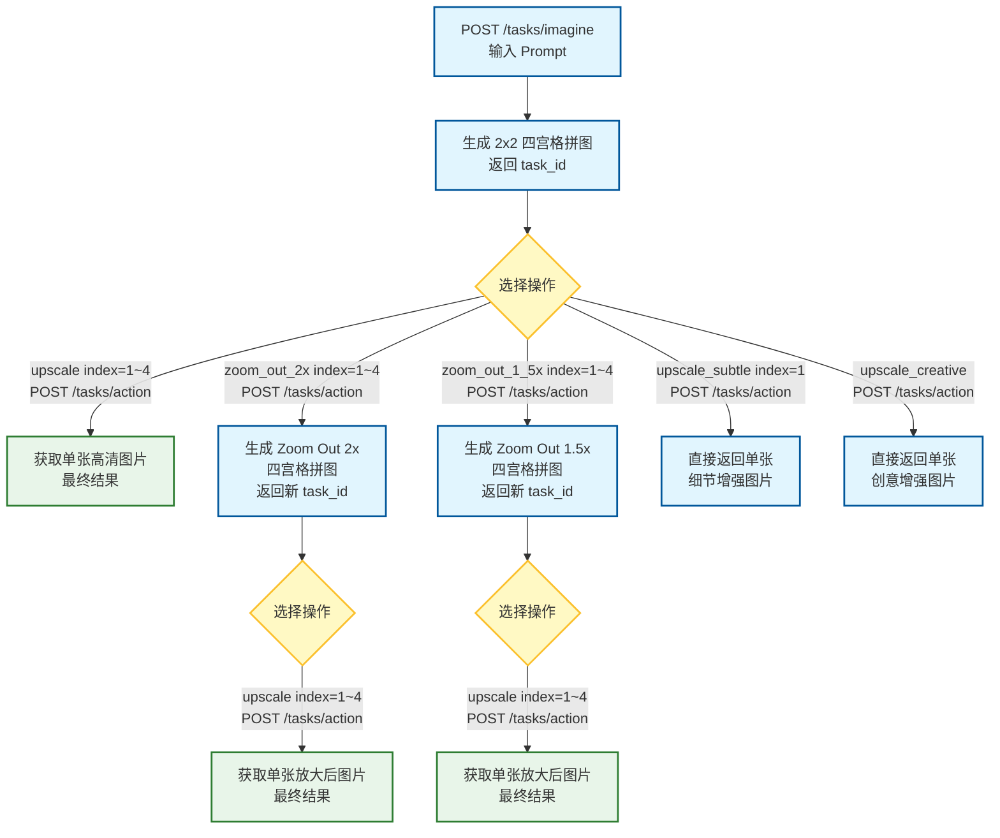

# Midjourney API

[简体中文](README_ZH.md) / [English](./README.md)

Midjourney 的非官方 API 服务，通过 Discord Bot 与 Midjourney 交互，提供标准 RESTful 接口，支持多账户并发、任务队列、图片自动上传至对象存储等功能。

## 功能特性

- **图片生成**：通过提示词（Prompt）调用 Midjourney `/imagine` 指令生成图片
- **任务操作**：支持 Upscale、Zoom Out 等图片后处理操作
- **多账户管理**：支持配置多个 Discord 账户，实现并发处理与负载均衡
- **任务队列**：基于 Redis 的异步任务队列，支持多 Worker 并发消费
- **对象存储**：图片生成后自动上传至阿里云 OSS 或 AWS S3
- **Swagger 文档**：内置 API 文档，访问 `/swagger/index.html` 即可查看

## 技术栈

| 类别 | 技术 |
|------|------|
| 语言 | Go 1.23+ |
| Web 框架 | Gin |
| 数据库 | PostgreSQL + GORM |
| 缓存/队列 | Redis |
| Discord | discordgo (WebSocket) |
| 对象存储 | 阿里云 OSS / AWS S3 |
| 日志 | Zap |
| 配置 | Viper |
| 容器化 | Docker / Docker Compose |

## 项目结构

```
midjourney-api/
├── cmd/server/         # 程序入口
├── config/             # 配置文件
├── internal/
│   ├── app/            # 应用初始化与生命周期管理
│   ├── config/         # 配置结构体
│   ├── discord/        # Discord WebSocket 监听与消息解析
│   ├── handler/        # HTTP 请求处理器
│   ├── middleware/     # 中间件（日志、恢复等）
│   ├── model/          # 数据模型
│   ├── oss/            # 对象存储上传器
│   ├── redis/          # Redis 客户端
│   ├── repository/     # 数据库操作层
│   ├── router/         # 路由注册
│   ├── service/        # 业务逻辑层
│   └── worker/         # 异步任务 Worker
└── pkg/
    ├── constants/      # 常量定义
    ├── errors/         # 错误定义
    ├── logger/         # 日志初始化
    └── response/       # 统一响应格式
```

## 快速开始

### 前置条件

- Go 1.23+
- PostgreSQL 15+
- Redis 7+
- 一个或多个已加入 Midjourney 服务器的 Discord Bot

### 方式一：Docker Compose（推荐）

```bash
# 1. 克隆仓库
git clone https://github.com/your-username/midjourney-api.git
cd midjourney-api

# 2. 修改配置文件
cp config/config.yaml.example config/config.yaml
# 编辑 config/config.yaml，填入 Discord Token、Guild ID、Channel ID 等信息

# 3. 启动服务
docker-compose up -d
```

服务启动后访问 `http://localhost:8080`

### 方式二：本地运行

```bash
# 1. 安装依赖
go mod download

# 2. 启动依赖服务（PostgreSQL + Redis）
docker-compose up -d postgres redis

# 3. 修改配置文件
# 编辑 config/config.yaml

# 4. 生成Swagger文档
swag init -g cmd/server/main.go -o docs

# 5. 编译构建
go build -o bin/server.exe ./cmd/server

# 6. 运行服务
./bin/server
```

## 配置说明

编辑 `config/config.yaml`：

```yaml
server:
  port: 8080
  mode: debug  # debug / release

database:
  host: localhost
  port: 5432
  user: mj_admin
  password: 123456
  dbname: midjourney

redis:
  host: localhost
  port: 6379

discord:
  application_id: "936929561302675456"   # Midjourney Bot 应用 ID（固定值）
  imagine_command_id: "938956540159881230"
  imagine_command_version: "1237876415471554623"
  accounts:
    - name: "account1"
      bot_token: "YOUR_BOT_TOKEN"
      user_token: "YOUR_USER_TOKEN"
      guild_id: "YOUR_GUILD_ID"
      channel_id: "YOUR_CHANNEL_ID"

task:
  timeout: 300       # 任务超时时间（秒）
  max_retries: 3       # 任务最大重试次数
  worker_count: 3    # Worker 并发数

oss:
  enable: false      # 是否启用 OSS 上传
  provider: aliyun   # s3 / aliyun
```

### 获取 Discord Token

1. 前往 [Discord Developer Portal](https://discord.com/developers/applications) 创建 Bot
2. 将 Bot 邀请至已加入 Midjourney 的服务器
3. 复制 Bot Token 填入 `bot_token`
4. 右键服务器图标 → 复制服务器 ID 填入 `guild_id`
5. 右键目标频道 → 复制频道 ID 填入 `channel_id`

> **注意**：需要在 Discord Developer Portal 开启 `MESSAGE CONTENT INTENT` 权限

## 使用流程

### 标准工作流



> **说明**：
> - `upscale`：将四宫格中指定位置的图片放大为单张高清图，可继续执行后续操作
> - `zoom_out_2x`：对指定图片执行 2 倍缩小视角（扩展画布），生成新的四宫格拼图，需再次 Upscale 获取单张
> - `zoom_out_1_5x`：对指定图片执行 1.5 倍缩小视角（扩展画布），生成新的四宫格拼图，需再次 Upscale 获取单张
> - `upscale_subtle` / `upscale_creative`：直接对指定图片做细节或创意增强，**直接返回单张图片**，无需二次操作

## API 接口

### 任务管理

| 方法 | 路径 | 说明 |
|------|------|------|
| `POST` | `/api/v1/tasks/imagine` | 创建图片生成任务 |
| `POST` | `/api/v1/tasks/action` | 执行任务操作（Upscale/Zoom Out 等） |
| `GET` | `/api/v1/tasks/:task_id` | 查询任务详情 |
| `GET` | `/api/v1/tasks` | 获取任务列表 |
| `GET` | `/api/v1/tasks/queue` | 获取等待队列 |

`/api/v1/tasks/action` 支持的 `action_type` 值：

| action_type | 说明 |
|-------------|------|
| `upscale` | 普通放大，将四宫格中指定图片放大为单张高清图 |
| `zoom_out_2x` | 2 倍缩小视角（扩展画布），生成新的四宫格拼图 |
| `zoom_out_1_5x` | 1.5 倍缩小视角（扩展画布），生成新的四宫格拼图 |
| `upscale_subtle` | 精细放大（细节保留），直接返回单张增强图片 |
| `upscale_creative` | 创意放大（重新渲染），直接返回单张增强图片 |

### 账户管理

| 方法 | 路径 | 说明 |
|------|------|------|
| `GET` | `/api/v1/accounts` | 获取账户列表 |
| `GET` | `/api/v1/accounts/:id/health` | 查询账户健康状态 |
| `PUT` | `/api/v1/accounts/:id/health` | 更新账户健康状态 |

### 健康检查

| 方法 | 路径 | 说明 |
|------|------|------|
| `GET` | `/live` | 存活检查 |

### 示例请求

**创建图片生成任务**

```bash
curl 'http://localhost:8080/api/v1/tasks/imagine' \
  -H 'Content-Type: application/json' \
  --data-raw $'{\n  "prompt": "a cute cat"\n}'
```

**查询任务状态**

```bash
curl http://localhost:8080/api/v1/tasks/{task_id}
```

**执行 Upscale 操作**

```bash
curl 'http://localhost:8080/api/v1/tasks/action' \
  -H 'Content-Type: application/json' \
  --data-raw $'{\n  "action_type": "upscale",\n  "index": 4,\n  "task_id": "xxx"\n}'
```

## Swagger 文档

服务启动后访问：`http://localhost:8080/swagger/index.html`

## License

Apache License 2.0
